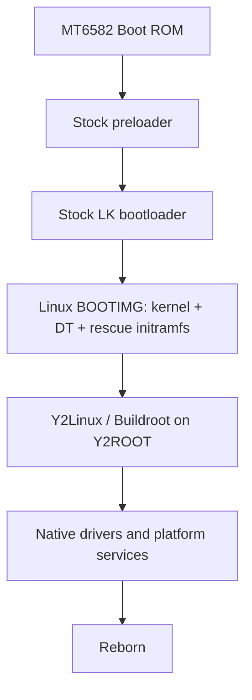
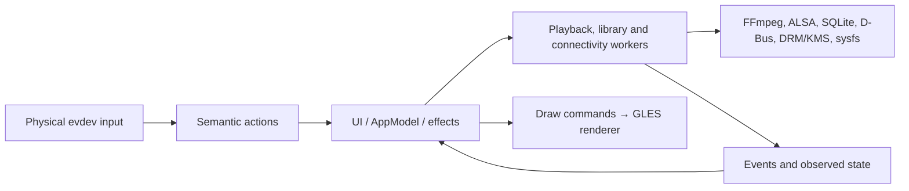

# Current Y2Linux + Y2Reborn project state

**Historical 2026-09-22 review at the exact commits below.** Its "current",
"next" and unmet-implementation findings describe that audit snapshot. Some
software defects were later corrected and real Fix01 workload/playback behavior
was tested; the overall CPU platform still fails acceptance. Use
[current Reborn state](../CURRENT_REBORN_STATE.md) and the paired
[Linux state](../../../Y2Linux/docs/CURRENT_PLATFORM_STATE.md) for today's
status. The original review conclusions remain available as dated evidence.

**Review date: 2026-09-22. Read-only engineering review; documentation is the only change.**

## 1. Executive summary

**What is Y2Reborn today?** A native Linux music-player application running on a substantially working, custom Linux platform for the Innioasis Y2. It has a real accelerated interface, library/database, playback engine and radio-service integration. It is an **owner development system with significant physical foundations**, not a qualified consumer-player release.

**Luna made useful, technically substantive improvements, but the stabilization claim is too broad.** The original FFmpeg frame-shell leak is fixed; sink release now precedes probing; database writes are acknowledged; queue occurrences have identities; the selected userspace upgrades really are built. Several original correctness boundaries remain open, and this review found new defects in session/render state, filtered-track queue actions, input-loss handling and the proposed S24 output path. Keep the work as a development base, with a corrective pass before feature expansion. A wholesale rollback or architecture replacement is unwarranted.

| Question | Current answer |
|---|---|
| What physically works? | Earlier identified builds boot from internal storage, show hardware-accelerated graphics, receive buttons/wheel, play clean S16/44.1-kHz wired audio, offer USB SSH, and scan Wi-Fi. Bluetooth controller/adapter power and discovery infrastructure work. |
| What is only implemented? | Much of the current player behavior, Wi-Fi connection lifecycle, Bluetooth pairing/SBC playback, charging revisions and integrated suspend corrections. Their implementation/build evidence exceeds their retained physical qualification. |
| What remains broken? | Several failure/recovery paths and user-state semantics detailed below. S24 conversion is demonstrably wrong; current SBC does not use that path. |
| Can development continue from HEAD? | **Yes, as an explicitly unfinished development baseline. No, as a signed-off stabilization or release baseline.** |
| Was the modernization candidate physically tested? | **No.** This review accessed no device and flashed nothing. Older evidence is not transferred automatically to new userspace. |
| Best next direction? | Correctness closure → controlled qualification of the exact candidate → release/build contract cleanup. SBC precedes optional Bluetooth codecs; true wired high resolution is a separate hardware milestone. |

### Reviewed identities and evidence limits

Both repositories were checked with `git status`, `git rev-parse HEAD` and `git log --oneline --decorate -30`; the reported heads were confirmed.

| Repository | Audited baseline → actual HEAD | Initial working state |
|---|---|---|
| Y2Linux | `be7e64c5dd5c6bdfe39c35e8fbd70e6b4b2c4717` → `8e5b53bc9fb934e1f668b9e7e9e34f0fc5e4130e` | Clean; `main` ahead of local `origin/main` by 29. |
| Y2Reborn | `011884b7ef13187171225f252c213afeeb6da851` → `8a1443daa25419834c800a7f9d707e66f80e0f90` | `main` ahead by 37; existing untracked `docs/audit/` and `docs/architecture/bluetooth-codecs.md`. These were reviewed and preserved. |

All intervening changes were examined: Linux 13 files, +267/−33; Reborn 15 files, +1499/−217. Linux changes do not alter kernel drivers, DT or kernel configuration. Reborn's last two commits only update Luna's report. The existing ARM package records Reborn **`42dc1f562d00439e8edcbb52fc070be28a69378e`**, which contains the same production code as current HEAD, and Linux `8e5b53b…`.

The package labels itself release `0.1.0-premium.3`, rootfs `2025.02.18-premium.3`, with layout/data schema 1. Reborn's application label is `0.1.0-premium.01`; its session schema is 2 and library DB schema is 1. These separate version domains should not be confused with hardware acceptance.

Primary inputs were all 16 [current-system audit files](../audit/current-system/00_SCOPE_AND_EVIDENCE.md), the [codec architecture](../architecture/bluetooth-codecs.md), its [evidence](../audit/bluetooth-codecs/2026-09-22-evidence-and-tests.md), [Luna's report](../validation/LUNA-SOFTWARE-MODERNIZATION-01.md), actual before/after source, generated package configuration, ELF files and retained raw validation output. Luna's report is a claim source, not acceptance evidence. This review activates/closes no milestone and authorizes no hardware, memory or production-scope change; the [standing roadmap audit rule](../../../Y2Linux/docs/planning/roadmap-gap-audit.md#standing-milestone-boundary-rule) still applies before those decisions.

## 2. Luna change review

`VERIFIED_FIXED` below means the specified software defect has convincing source/targeted evidence; it does **not** mean physical product qualification. `PARTIAL` identifies both a real improvement and a remaining defect. Detailed source locations and failure traces are in [LUNA_STABILIZATION_REVIEW.md](LUNA_STABILIZATION_REVIEW.md).

### P0 correctness groups

| Finding | Classification | Independent conclusion |
|---|---|---|
| F01 media lifetime | **VERIFIED_FIXED** for the original leak | `source_to_canonical` frees the AVFrame shell after successful reference transfer, zero output and errors. Reusable decode frames and packets are unreferenced; open failure/close free owned resources; seek resets decoder/filter/resampler state. Next-track preparation owns a separate decoder. No replacement lifetime error established. Allocator-aware and ARM endurance evidence remains absent. |
| F02 sink ownership | **PARTIAL** | `stop_and_wait` releases the worker's ALSA handle before `AlsaSink::plan` probes. This fixes the original exclusive-open ordering. Planning still runs synchronously on the UI thread and the worker subsequently reopens. A failed plan after release leaves mutated settings/output and often `Playing` state with no sink. The blocking command send precedes the advertised two-second reply timeout. Volume, seek, RG, EQ, skip and output switching still reconstruct playback. |
| F03/F08 queue authority | **PARTIAL** | Duplicate occurrences now have queue-entry IDs, and successful active edits rebuild the execution snapshot. Album/artist/folder playback carries collection membership. Remaining defects: a single track's Play Next/Add to Queue inside a filtered collection inserts the whole collection; shuffle toggles only affect later queue construction; error rollback is incomplete. Parallel track/ID vectors and a copied worker schedule require maintained invariants. |
| F04 crossfade | **PARTIAL** | Large PCM windows are split into sink-bounded blocks, so 5/10/15 seconds no longer inherently exceed the 524,288-byte limit. Mix-error fallback restores the consumed next-track prefix. However, a later decode error while assembling that prefix discards already accumulated samples, then continues the advanced decoder. Full windows and copies remain in memory. The playback test uses 50 ms, not 5/10/15 seconds or injected failures. |
| F05 scan commit | **PARTIAL** | Batch and finalization SQL results are acknowledged; a failed batch cannot become successful completion or proceed to pruning. But decoder-open failures leave the scan marked complete, and `root.is_dir()` cannot distinguish an SD mount from its surviving empty mountpoint. Previously valid library rows can still be marked deleted after an incomplete/source-lost scan. Music files themselves are not deleted by this SQL. |

Queue semantics traced: duplicates are distinguishable; successful remove/reorder/clear operations update IDs and replace active playback; current-entry removal is refused; clear keeps the current/past prefix and removes future entries. Repeat-one reloads the current track; repeat-all restarts the queue at its end, with a sink restart rather than seamless wrapping. Shuffle is applied when constructing a new play queue. Collection playback is materially improved, but the context-action defect and metadata edge cases prevent complete sign-off.

### P1 findings

| Finding | Classification | What improved / what remains |
|---|---|---|
| F06 persistence | **STILL_BROKEN** | Schema-2 envelope, legacy migration and matching 8-MiB read/write limits are useful. The new save condition reuses render `dirty`; rendering clears persistence intent, and successful saves clear pending redraws. Whole-model synchronous checkpoints remain. This is a new current user-state regression. |
| F07 corrupt DB recovery | **PARTIAL** | Bad-header DBs are quarantined and recreated; future schemas are rejected. Almost any other open/setup error on an existing file also triggers quarantine, including operational failures. DB/WAL/SHM renames lack transactional recovery. This can unnecessarily detach valid state; only the simple corrupt-header case is tested. |
| F09 format discovery | **VERIFIED_FIXED** | AIFF, APE and WavPack extensions now reach the existing FFmpeg decoders; actual ARM decoder/demuxer configuration agrees. This does not qualify every file/metadata variant. |
| F11 seek | **PARTIAL** | Timestamp-based trimming removes decoded audio preceding the requested position, before canonical conversion; the 500-ms test exercises it. Untimestamped streams, lossy priming, mixed-rate boundaries, sink restart and exact presented-position semantics remain incompletely covered. |
| F12 ReplayGain/headroom/EQ | **PARTIAL** | Finite/range-checked tags, explicit zero handling, album fallback and limiter `level=0` are sound. EQ still has an enabled switch with default empty bands and no user band/preset editor. Exact mute, post-resampling peak behavior and dither policy remain undefined/unqualified. |
| F20 input | **PARTIAL** | Queued releases are processed before long-press aging; some screen-off behavior improves. `SYN_DROPPED` generates normal releases, which the action router interprets as Select/skip/Power actions. Kernel timestamps and proper resynchronization are still absent. The new tests do not exercise a real evdev backlog. |
| F21 UI/state truth | **PARTIAL** | Capacity fiction, SD labeling, navigation context and unsafe glyph indexing improve. Save/redraw coupling, queue-context behavior, incomplete collection metadata handling and operation-state failures remain. |
| F24 artwork | **PARTIAL** | Cache hits avoid rewrites; events identify a track. They do not identify a queue occurrence, and artwork can overtake a queued audio boundary on another channel, be rejected as premature, and never be resent. Sidecar identity and transition clearing remain incomplete. |
| F25 diagnostics | **PARTIAL** | Packet deltas improve. Open-time decode flags and stale audio state can still mislead; Reborn's static FFmpeg label remains `9.0.1` while the ARM library is `9.0.2`. The ARM QEMU checker also still asserts `9.0.1`/`.101` libraries. |
| F26 storage errors | **PARTIAL** | Database write errors are better propagated. Startup/hotplug mount and unmount results are still ignored at important call sites; removal/full-disk recovery remains unqualified. |

### New S24 defect and BlueALSA readiness

The typed negotiated format is a good direction, but **S24 support is not correct**. Rust and ALSA define format 3 as signed 24-bit samples in four-byte containers; C's `format_from_int(3)` returns `AV_SAMPLE_FMT_S16`. A direct call to the existing native library converted stereo S32 `[1073741824, -1073741824]` into bytes `00 40 00 c0 00 00 00 00`: S24 containers `[-1073725440, 0]`, instead of `[4194304, -4194304]`. The added S24 test uses zeros and misses the defect.

Current SBC is S16 and unaffected by this specific bug. S32 follows the S32 branch and does not inherently pass through S16. Wider-codec readiness also needs real transport epochs and format revalidation: the current generation is a hash of the PCM path, while the installed `bluealsa:` PCM is an ALSA `plug` wrapper that can conceal a stale-format conversion. Optional codecs being disabled is appropriate and is not a negative finding.

### Tests and build evidence

The retained final workspace output really reports **91 passing tests**. This review independently reran **45 existing cached host tests**: playback 6, media 15, core 7, library 8, input 9; all passed. These binaries were not rebuilt. The separate nonzero S24 probe failed its sample contract. No test/source fixtures were added or changed.

The existing fresh-output ARM build has actual upgraded package trees and installed libraries. This review reran the generated FFmpeg component/ELF verifier and the production package/rootfs validator: **both passed**, including preserve-data packaging and ext4 identity. ELF inspection confirmed dynamic BlueALSA dependencies, Reborn's lazy FFmpeg boundary, `libasound.so.2` and `libsqlite3.so.0`. This is build/integration evidence, not an ARM behavioral or hardware acceptance pass. Current QEMU assertions must be updated before that check can truthfully validate FFmpeg 9.0.2.

The original broad sweep ran 123 tests and returned **1 failure + 42 errors**. Its raw output was inspected and representative failures traced into the fixtures/current source:

| Root cause | Count | Classification / evidence |
|---|---:|---|
| Old artifact/configuration expectations | 3 errors + 1 failure | **WRONG_PROFILE**: tests expect the D08 small-memory DT, storage-04 configuration and `/build/init`; supplied artifacts are the GPU-02 production package. The DT mutation does not match the current DT bytes. |
| Old register-write policy expectation | 1 error | **OBSOLETE_TEST**: the baseline fixture expects zero masks at locations now explicitly owned by charging/CONSYS policy. Those changes predate Luna. |
| Legacy PID1 syscall fixtures | 32 errors | **HISTORICAL_FIXTURE_MISMATCH**: QEMU executes, then fixture assertions exit (mostly 43; also 158/170). Expectations reject current tty/sysfs access and loop behavior. These compile diagnostic C PID1, not production shell `/init`. They are not 32 missing-QEMU errors. |
| Legacy evdev fixture | 1 error | **HISTORICAL_FIXTURE_MISMATCH**: fixture assigns/compares scalar `nav.fd`; current structure contains an FD array. |
| Relay protocol marker fixtures | 2 errors | **HISTORICAL_FIXTURE_MISMATCH**: expect `Y2LINUX-DEV-01`, current relay emits `Y2LINUX-PLATFORM`; both host and ARM assertions fail. |
| Offline-charge compilation / splash setup | 3 errors | **ENVIRONMENT_DEPENDENCY**: two compilations lack `linux/fb.h`; splash lacks host `libdrm.pc`. The production runner supplies the UAPI include environment; unrestricted discovery did not. |

**No new product regression is established by those 43 results.** The unmaintained broad runner is still a test-infrastructure debt, not a green suite. Conversely, passing focused tests did not catch the real source defects above. Missing boundary tests include failed sink reopen, scan batch/finalization/full-disk/source loss, 5/10/15-second crossfades with decode failure, live queue operations, save/render cadence and nonzero S24 values.

## 3. Architecture overview

BOOTIMG establishes storage identity, root/data mounting and recovery before handing over to Buildroot/BusyBox. Y2Linux owns hardware, filesystem policy, power and radio infrastructure. Reborn owns the player and user interaction. Stock early boot is retained; this is not a new bootloader or Android application.

The Rust application coordinates bounded workers; native C boundaries handle FFmpeg, ALSA and graphics. AppModel holds user/session state, while service observations report reality. The remaining bugs largely concern synchronizing those boundaries, rather than an unsuitable architecture.

### What is good — preserve these foundations

- Stock boot/recovery compatibility, explicit partition identity and preserve-data updates.
- Platform ownership of shared CONSYS power/reset/calibration and PMIC/source control.
- FFmpeg as the sole decode/resample/DSP/sample-conversion authority, loaded behind a small native boundary.
- One SQLite writer, stable source/path identities, transaction batching and retained offline entries.
- One ALSA writer actor and generation cancellation; finish its reconfiguration/error contract.
- Semantic input, UI/service separation and native DRM/GBM/EGL/GLES rendering.
- Bounded local diagnostics, structured events, restricted control commands and persistent owner SSH identity.
- `y2-bt-reconnect` as the single automatic Bluetooth connection-retry owner.

Do not replace these with another media engine, database, GUI framework, radio retry service or boot scheme to address local correctness defects.

## 4. Hardware/platform overview

Status labels: **WORKING / PHYSICALLY EVIDENCED** refers to the stated older measurements; **IMPLEMENTED BUT NEEDS CURRENT QUALIFICATION** means code exists without sufficient current proof. **PARTIAL**, **MISSING** and **UNKNOWN** retain their literal meanings.

| Subsystem | Status | Actual evidence and limit |
|---|---|---|
| CPU / memory | WORKING / PHYSICALLY EVIDENCED | MT6582, four Cortex-A7 cores; 992-MiB DT bank with reserved exclusions and HIGHMEM. Physical MemTotal about 932 MiB; bounded 256-MiB allocation exercised HIGHMEM. Current fixed-voltage CPU policy spans 598–1040 MHz. No full-memory endurance qualification. |
| Display | WORKING / PHYSICALLY EVIDENCED | Native 480×360 Mediatek DRM/KMS/DSI panel; visible boot/UI and page flips. Broader sleep/resume sequencing remains open. |
| Mali GPU | WORKING / PHYSICALLY EVIDENCED | Mali-400 MP2, Lima, Mesa GLES2; actual hardware renderer, 30-FPS bounded graphics workload and runtime power-down demonstrated. Integrated deep resume remains unqualified. |
| Buttons | WORKING / PHYSICALLY EVIDENCED | Balanced evdev events and device-aware mapping. Current long-press/lost-event semantics require correction and qualification. |
| Wheel | WORKING / PHYSICALLY EVIDENCED | APT32F/I²C input, both directions and IRQ/completion evidence. Current acceleration/focus behavior is software-tested, not fully physically qualified. |
| eMMC | WORKING / PHYSICALLY EVIDENCED | Approximately 7.82-GB physical user area; internal root/data boot and filesystem checks. Wider crash/write/endurance coverage remains open. |
| SD | WORKING / PHYSICALLY EVIDENCED | Native host, mounted-card/media observations; ext4/FAT support. Current scan/removal/eject/error behavior remains incomplete. |
| USB | PARTIAL | Peripheral ACM/USB-network/owner SSH works. Reconnect problems have a scoped runtime-PM workaround with limited proof. Host/OTG power and USB audio are not qualified or enabled product paths. |
| CS43131 audio | WORKING / PHYSICALLY EVIDENCED | Clean stereo S16/44.1-kHz fixtures under GPU load used 1,024-frame periods / 8,192-frame buffers. Reborn requests 512 / 4,096; its current control/recovery paths need equivalent acceptance. |
| Charging / power | PARTIAL | Native policy/watchdog/source handling implemented; older observations and owner acceptance exist. Current charge-current revision, useful charging under load and cell safety are not established. |
| RTC | IMPLEMENTED BUT NEEDS CURRENT QUALIFICATION | Driver/epoch handling and alarm plumbing exist; retained observations include incorrect calendar time. Persistence and same-session RTC wake need proof. |
| Thermal | PARTIAL | CPU/PMIC sensing and policy exist; bounded GPU workload measurements are retained. These are die sensors, not battery-cell temperature/current qualification. |
| Wi-Fi | WORKING / PHYSICALLY EVIDENCED | Registration, power cycling and scans. Association/DHCP/DNS/traffic and saved reconnect have no retained acceptance. |
| Bluetooth | PARTIAL | Controller/adapter power and discovery established. No retained paired-peer/SBC playback qualification, including on BlueALSA 5. |

Principal physical receipts: [GPU/audio/runtime-PM and failed suspend, September 18](../../../Y2Linux/docs/hardware-evidence/2026-09-18-gpu01/README.md), [connectivity scans, September 17](../../../Y2Linux/docs/hardware-evidence/2026-09-17-m5-connectivity10/README.md), [installed Reborn inspection, September 18](../validation/2026-09-18-radio-inspection.md). Historical milestone wording inside those receipts is historical, not this review's current project status.

## 5. Audio overview

**File → FFmpeg demux/decode → canonical stereo planar float → volume/ReplayGain/EQ/limiter → final rate/format conversion → ALSA sink.** Crossfade retains next/previous PCM windows and uses FFmpeg mixing; transition working buffers are S32. Outputs are internal CS43131 and Bluetooth via BlueALSA.

| Precision boundary | What actually exists |
|---|---|
| Source | FFmpeg can decode 16-bit, 24-bit, wider integer and floating sources, including high-rate files. Decoded source precision is not the final output precision. |
| Internal processing | Canonical `FLTP` is 32-bit floating point, about 24 significant binary digits. FFmpeg filters may negotiate other internal formats, including double for the limiter. This is not an end-to-end 64-bit or bit-perfect pipeline. |
| Wired ALSA | Production qualification profile permits **S16_LE, stereo, 44,100 Hz**. Other source rates are resampled to that profile. AFE code advertises 44.1/48 kHz, but 48 kHz is not enabled in the product qualification profile. |
| I²S | **32-bit slots carry the current 16-bit sample payload.** Slot width does not make this 32-bit audio. |
| Bluetooth | Current SBC path uses negotiated S16 stereo at an accepted 44.1/48-kHz PCM rate. Negotiated S32 code exists; S24 container conversion is broken. Actual new-stack playback remains unqualified. |

ReplayGain metadata parsing and limiter headroom improve in Luna's pass. EQ's processing exists, but a normal user cannot configure bands/presets. Gapless preopening/continuous delivery exists, with tests for limited fixtures; lossy priming, heterogeneous formats/rates and repeat wrapping are not comprehensively qualified. Crossfade 5/10/15-second block sizing is repaired, but failure recovery, timing and memory are not signed off. One 15-second stereo S32 window at 44.1 kHz is **5,292,000 bytes**; several such windows, filter buffers and copies coexist. Thirty seconds doubles each window.

**True wired high resolution is missing from the exposed AFE path.** S32 DMA/sample format, preserved 24-bit payloads and native 88.2/96-kHz operation require AFE packing, DAI/codec format agreement, I²S framing and both clock families to be established. Existing 32-bit slots, generic DAC capability and source decoding are insufficient. Treat this as a separate, audited hardware milestone; do not unlock it merely by changing the qualification JSON.

## 6. Bluetooth / Wi-Fi overview

### Bluetooth

The observed MediaTek controller reports Bluetooth 4.0 and BR/EDR capability. Software codecs run on the application CPU through BlueALSA; controller capability alone does not prove codec throughput or coexistence. LE Audio is not an implemented path for this controller stack.

| Layer / behavior | Current state |
|---|---|
| Shared radio/controller | One Y2Linux CONSYS owner handles firmware/calibration, power/reset and transports. Controller initialization and adapter operation have physical evidence. |
| BlueZ | 5.87; device discovery, pairing, bond storage and explicit connection APIs integrated. Reborn does not implement a competing automatic `Device1.Connect` loop. |
| BlueALSA 5 | Service launches `bluealsad`; D-Bus service remains `org.bluealsa`, PCM discovery uses ObjectManager at `/org/bluealsa`, interface `org.bluealsa.PCM1`. |
| Negotiated PCM | Reborn reads **Rate**, **Format**, Channels, Device, Transport, Mode and observed Codec; selects the connected address's exact Device path and A2DP-source/sink PCM. This correctly replaces the old `Sampling` assumption. Stereo and 44.1/48-kHz policy are enforced. |
| Precision/readiness gaps | S24 conversion defect; path hash is not a transport lifetime; no fresh format/epoch assertion at open/write; default ALSA plug can mask a mismatch. Address-based PCM open does not bind an immutable observed object. |
| Pairing/trust | Successful user-requested Pair attempts `Trusted=true`; interactive confirmation remains explicit. Trust-set failure is logged, but operation completion can still look successful. Pair/forget/cancel/trust behavior needs real-peer testing. |
| Reconnect | Linux `y2-bt-reconnect` owns automatic retries; BlueZ `ReconnectAttempts=0`. Reborn's D-Bus service reconnection is not a peer-connect retry loop. Retry/failure UX remains to be qualified. |
| Codec observation | The observed PCM Codec is read. There is no complete requested-versus-actual codec policy/UI yet; no codec should be inferred merely from a preference or sample width. |
| Current codecs | **SBC only** in the actual BlueALSA build. Optional AAC/aptX/aptX HD/LDAC macros are disabled. File AAC decoding is unrelated to Bluetooth AAC encoding. |
| AVRCP | Missing Reborn player registration/control/metadata integration. BlueZ infrastructure is not a working product feature. |
| Auto codec | Missing application policy, capability selection, fallback/recovery and truthful requested/actual presentation. The codec architecture document is a proposal, not implementation authorization. |

The new types make optional codecs easier to add, but **the complete path is not software-ready yet**. Repair conversion/transport identity, qualify SBC, then add capabilities deliberately. No optional-codec absence is counted as a stabilization failure.

### Wi-Fi

Native cfg80211 scanning and shared-radio operation are physically proven. Reborn handles scan UI, saved WPA-PSK configuration and association requests; wpa_supplicant owns association/reconnect, while platform event handling starts DHCP and installs network configuration. WPA `COMPLETED` alone is not proof of an address, route, DNS or Internet access.

Retained results include 23/12 BSS entries during the platform run, later 19/23 with GPU/radio activity, and 28 through installed Reborn. Both radios being powered while a scan succeeds proves limited coexistence only. **No retained successful WPA association, DHCP lease, DNS query, sustained transfer, saved-network reconnect or Bluetooth-audio-plus-Wi-Fi traffic run was found.** Current UI supports the intended WPA-PSK case; open networks, enterprise authentication and WPA3 are not complete product paths.

## 7. Library / state / UI overview

**Library:** A scanner walks internal music and mounted SD sources, reuses size/mtime metadata, and sends 64-track transactions to one SQLite writer. Source identity is internal or SD UUID plus path; unplugged sources can remain indexed as offline. Albums/artists/folders are views over track metadata. The current pruning and storage-error defects must be corrected before hot-removal can be trusted.

**Scale:** Queue and query-result cap: **20,000 tracks**; scan/existing-record guard: **250,000**; session file cap: **8 MiB**. These are implementation limits, not a measured supported library size. The UI loads a bounded first result set, clones track collections during interaction and rebuilds rows; it has no completed paged browsing contract. Full queue/session serialization and artwork/decode allocations compound memory use. A representative 10k/20k library needs target RSS/latency measurement before promising that scale.

**State:** Queue occurrence identity is separate from library track identity. Sessions use an explicit schema, bounded load/save and temporary-file/fsync/rename persistence, restoring paused. These foundations are useful; render/persistence dirty-state coupling is wrong. Corrupt-DB quarantine is implemented but needs error classification and recoverable multi-file handling. “Rebuild library” currently performs an incremental scan, not a complete forced metadata repair/recovery workflow.

**UI architecture:** Native draw commands → GLES2 textures/quads → GBM/KMS presentation; no browser/desktop compositor is required. Screen/navigation state, focus, modal actions and service effects are mostly separated. Physical wheel navigation, Select/Back, playback/volume keys and Power have semantic mappings. Screen-off suppresses browsing; volume/playback actions can continue, and Power wakes the display. Long-press/lost-input edge cases remain.

**Design maturity:** This is a functioning interface architecture with an unfinished visual/product layer. Another visual-design pass is appropriate. Typography, spacing, hierarchy, colors, icons, album presentation and navigation feedback can evolve independently once action/state contracts are stable. International text, collection edge cases, truthful errors, stale artwork and scale responsiveness remain practical UX gaps. Architecture quality does not establish visual-design quality.

## 8. Power / storage / recovery overview

### Power

The native charger has explicit PMIC register ownership, validation, watchdog handling and fault containment. Source detection has one USB-PHY owner. Current policy includes a 4.175-V target, 4.200-V software ceiling and 4.110-V recharge threshold. Deep-recovery/precharge policy now permits up to 450 mA below 3.4 V; configured source-dependent limits include 450 mA for the normal SDP allocation and 650 mA for recognized higher-current sources. **Configured charging current is not measured pack current or total USB input current.**

Earlier 70-mA observations showed falling battery voltage under load; they do not validate the later current revision. POWER-03 owner acceptance is real historical acceptance, not a current electrical measurement. Battery-cell temperature, reliable state of charge, actual current, useful charging under load, source/cable limits and cutoff behavior remain insufficiently established. **Unattended charging safety is UNKNOWN.**

- **Offline charging:** dedicated early-boot charging UI/policy exists, with deliberate Power-button boot and a voltage guard. Current integrated behavior still needs qualification.
- **Low battery:** boot-time guard exists; complete normal-runtime warning, checkpoint and graceful low-battery shutdown policy is missing.
- **Display sleep:** panel/backlight and renderer resources can be released while audio continues. This is not deep suspend.
- **GPU runtime PM:** bounded physical power-down/redraw observations exist.
- **Deep suspend:** helper/activity leases/radio quiescence and CPU-mask corrections are implemented. The retained GPU-01 attempt failed to resume in the same boot; CPU3 ACK-mask failure was diagnosed and corrected for GPU-02. Same-boot RTC/Power wake with integrated graphics/audio/storage remains unqualified.

### Storage and updates

| Component | Role | Normal update policy |
|---|---|---|
| BOOTIMG | Android-format container with Linux kernel, DT and rescue/initramfs | Update as the matching system package requires. |
| Y2ROOT on stock `ANDROID` / p5 | Buildroot userspace, services, Reborn and native libraries | Update with BOOTIMG using the preserve-data package. |
| Y2DATA on stock `USRDATA` / p7 | Music, player DB/session/cache, network/bonds, SSH state and persistent data | **Preserve.** Initialize only for an explicitly intended first install/reset. |
| Preloader, LK, partition tables, NVRAM/PROTECT/calibration/factory regions | Boot/recovery and device-specific identity foundations | **Do not select during normal updates.** |

**Normal system updates select only `BOOTIMG` and `ANDROID`.** The reviewed candidate contains no Y2DATA image and its preserve-data validator passes. Rescue runs from initramfs and refuses incompatible root/data identities; manual fallback artifacts are retained. There is no automatic A/B rollback, atomic torn-BOOTIMG recovery, signed OTA chain or new verified-boot guarantee. Public installation/recovery qualification is still broader than the owner development workflow.

## 9. Current dependency stack

These are **selected/built versions**, checked against transformed Buildroot recipes, actual build directories, generated configuration and installed ELF/library names. The source authorities are the [Buildroot lock](../../../Y2Linux/buildroot/inputs.lock.json), [package adapter](../../../Y2Linux/tools/production/modernize_buildroot.py), [FFmpeg adapter](../../../Y2Linux/tools/production/ffmpeg9.py) and [Rust toolchain](../../rust-toolchain.toml). Upstream release freshness was not re-audited here.

| Component | Current version | Held/upgraded rationale and expected work |
|---|---|---|
| Linux | **6.18.0-y2linux-gpu-02** | Held; custom hardware/UAPI/power boundary. Separate qualification for driver/kernel changes. |
| Buildroot | **2025.02.18** | LTS point update from .17, with explicit local package overrides. Keep controlled maintenance and clean-build reproducibility work. |
| Rust | **1.90.0**, ARMv7 hard-float target | Repository toolchain held; direct crate pins/Cargo.lock unchanged. Separate toolchain migration if justified. |
| FFmpeg | **9.0.2** | Patch update from 9.0.1; minimal audio/artwork libraries. Repair stale runtime/checker labels and qualify decoding/DSP behavior. |
| ALSA lib / utils | **1.2.16.1 / 1.2.16** | Upgraded from 1.2.13; remove obsolete build options/patches. Requalify PCM negotiation, mixer restoration and XRUN/reopen behavior. |
| Mesa | **24.0.9** | Held with evidenced Lima renderer; future upgrade needs dedicated graphics/runtime-PM/resume checks. |
| libdrm | **2.4.124** | Held with graphics stack; no speculative migration. |
| SQLite | **3.53.4** | Upgraded from 3.50.4; system library via rusqlite 0.37.0, `libsqlite3.so.0`. Recovery/durability tests are more urgent than another version change. |
| BlueZ | **5.87** | Upgraded from 5.79; pairing/service behavior requires peer qualification. |
| BlueALSA | **5.0.0** | Upgraded from 4.3.1; daemon/API/build adaptation present. S24 and transport-generation corrections remain. |
| libsbc | **2.2** | Upgraded from 2.0; actual SBC encoder integration built, audio/CPU/coexistence unqualified. |
| wpa_supplicant | **2.12** | Held; qualify association/DHCP/DNS/reconnect before feature expansion. |
| BusyBox | **1.37.0** | Held; existing init/helper behavior. Routine maintenance, not an immediate migration. |
| Dropbear | **2026.94** | Upgraded from .93 in the previous LTS inputs; owner-key SSH/handshake/reconnect qualification needed. |
| OpenSSL | **3.5.8** | Selected by updated LTS inputs; normal security maintenance plus relevant network regression checks. |
| expat | **2.8.4** | Selected by updated LTS inputs; normal maintenance. |
| D-Bus | **1.14.10** | Held; avoid combining an unrelated build-system/service migration with this pass. |
| C toolchain | **Bootlin ARMv7 EABIHF 2024.05-1** | Held with existing glibc/ARM ABI contract. A later compiler/libc migration needs its own validation. |

### Integration/pinning assessment

Buildroot's archive is SHA-256 locked; guarded transformations install exact package versions and source hashes. This review independently matched cached Buildroot, FFmpeg, BlueZ, BlueALSA, SBC, ALSA-lib and SQLite archives to their pins. Source hashes establish local input identity, not repeat-build equivalence or a blanket security audit.

| Major change | Actual integration / ABI assessment | Exposure remaining |
|---|---|---|
| FFmpeg 9.0.2 | Audio/artwork-only generated configuration passes; no network, encoders, muxers, CLI or libavdevice. Native media library links ABI majors avutil 61, avcodec/avformat 63, avfilter 12, swresample 7, swscale 10; installed microversions are `.1.102`. Main Reborn ELF loads FFmpeg lazily. Old FFmpeg-6 patches remain excluded. | Host tests use the cached 9.0.1 media environment; current ARM runtime checker still expects `.101`. Clean acquisition also still requires the FFmpeg archive preseeded before the adapter runs. |
| BlueZ 5.87 | Headers/runtime pins agree. Removed musl/config/HID-HoG patches have corresponding code in the new source; shared `libbluetooth.so.3` remains. | Same D-Bus interface names do not prove pairing, agent timing, trust and reconnect behavior. |
| BlueALSA 5.0.0 | `bluealsad`, new configure switches, correct PCM property names; narrowly scoped removal of `-static` permits the actual shared ARM link. Optional codecs remain disabled in generated `config.h`. | Negotiation/lifetime and PCM precision gaps above; no real-peer result. |
| ALSA | MMU target makes the removed no-MMU fork patch irrelevant. Sequencer/rawmidi dependency is present upstream; obsolete ALISP option removed. `libasound.so.2` preserved. | The ALSA plug layer and newer PCM implementation require negotiation/recovery checks on the actual outputs. |
| SQLite | New source includes the formerly patched zipfile output-length and FTS5 bounds fixes; obsolete configure patch removed. Installed shared library has no build-host RPATH and matches Reborn's SONAME dependency. | Database upgrade/open/WAL/error behavior and power-loss recovery need targeted qualification. |
| Remaining upgrades | SBC/ALSA-utils/Dropbear have exact archive hashes in the adapter; OpenSSL/expat inherit hashes from the locked LTS tree. New package build trees and target installation exist. ALSA-utils service-file paths were adapted; the obsolete Dropbear compiler patch was removed. | SBC codec behavior, ALSA utilities/mixer behavior and SSH/TLS consumers need relevant regression checks. No broad API or security sign-off is implied by build success. |

One clean output directory with cached inputs does not establish a fresh-machine or byte-reproducible build. The manifest also still describes unimplemented **Y2PlayerNative**, despite packaging Reborn; the validator enforces part of that obsolete contract. Source/build IDs now align, but product identity and runtime receipts do not yet fully agree.

## 10. Master feature matrix

**Host** means some focused software checks exist, not complete failure coverage. **ARM** means present in the reviewed build, not executed successfully on hardware. **Older** physical evidence is explicitly from pre-candidate builds; no row claims physical acceptance of this modernization image. **Owner scope** means a useful established development foundation whose new package still needs qualification; it is not public-release approval.

| Feature | Implemented? | Host tested? | ARM built? | Physical evidence? | Production-ready? | Main remaining gap |
|---|---|---|---|---|---|---|
| Boot | Yes | Policy/artifacts | Yes | Older internal boot | Owner scope | Exact candidate and installation qualification |
| Rescue | Yes | Policy/package | Yes | Older owner workflow | Owner scope | Broader failure/operator recovery matrix |
| Internal storage | Yes | Policy/FS | Yes | Older root/data | Owner scope | Crash/write/endurance and update recovery |
| SD | Yes | Limited | Yes | Older mounts/media | No | Scan preservation, removal/eject errors |
| UI | Yes | State/draw tests | Yes | Older visible Reborn | No | State defects, current visual/latency pass |
| GPU | Yes | Policy/renderer | Yes | Older accelerated load/PM | Bounded owner scope | Integrated resume/recovery |
| Buttons/wheel | Yes | Mapping/actions | Yes | Older evdev/UI | No | Lost-event correctness and physical semantics |
| Wired playback | Yes | Media/fake sink | Yes | Older S16/44.1 audio | No | Current player controls, sink faults, soak |
| ReplayGain | Yes | Partial samples/tags | Yes | No level qualification | No | Gain/headroom/malformed-tag matrix |
| EQ | DSP only | Supplied band | Yes | No | No | User bands/presets and output qualification |
| Gapless | Yes | Limited fixtures | Yes | No retained acceptance | No | Lossy priming, rates/formats, repeat wrap |
| Crossfade | Partial | 50-ms path | Yes | No | No | 5/10/15 s, faults, timing, memory |
| Seek | Yes | Targeted trim | Yes | No current acceptance | No | Format/priming/position/control failures |
| Library scan | Yes | DB/basic scan | Yes | Older baseline diagnostic | No | Commit/source-loss/pruning boundaries |
| Albums/artists/folders | Yes | Limited UI | Yes | No current acceptance | No | Context actions, metadata/order edge cases |
| Queue | Yes | Model IDs | Yes | No current acceptance | No | Live mutations and failure rollback |
| Persistence | Partial | Schema/atomic basics | Yes | No durability proof | No | Separate save intent from redraw state |
| Corrupt DB recovery | Partial | Bad header | Yes | No | No | Classify errors, atomic recovery, state reconciliation |
| Wi-Fi scan | Yes | Service/UI | Yes | Older repeated scans | Bounded owner scope | Current-stack regression check |
| Wi-Fi connection | Yes, WPA-PSK | Limited/mocked | Yes | None retained | No | Association → DHCP → DNS → reconnect |
| Bluetooth pairing/trust | Yes | Mocked D-Bus | Yes | No peer acceptance | No | Real agent/trust/cancel/reconnect flow |
| Bluetooth SBC audio | Yes | Types/fake sink | Yes | None retained | No | Negotiated PCM/audio/fault/coexistence run |
| AVRCP | No app integration | No | BlueZ infrastructure only | No | No | Player/control/metadata registration |
| Bluetooth Auto codec | No product policy | No | No | No | No | Capability/selection/fallback state contract |
| AAC Bluetooth | Disabled | No product test | No encoder enabled | No | No | Deliberate integration after SBC |
| aptX | Disabled | No product test | No encoder enabled | No | No | Dependency/negotiation/qualification |
| aptX HD | Disabled | No product test | No encoder enabled | No | No | Correct S24 path plus codec integration |
| LDAC | Disabled | No product test | No encoder enabled | No | No | Codec/rate policy, throughput and power |
| High-res wired | No complete path | Conversion only | AFE S16 only | No | No | S32/24-bit payload/rates/clocks hardware milestone |
| Charging | Partial | Policy/fault ordering | Yes | Older limited/acceptance | No | Current measured useful charging and safety |
| Offline charging | Yes | Policy/UI | Yes | Older limited | No | Current source/voltage/exit qualification |
| Low battery | Boot guard only | Guard tests | Partial | No runtime policy proof | No | Runtime warning/checkpoint/shutdown |
| Display sleep | Yes | State/policy | Yes | Older blank/PM evidence | No full acceptance | Playback/input/wake qualification |
| Deep suspend | Partial | Corrected policy | Yes | Retained failure; no current pass | No | Same-boot RTC/Power resume |
| USB device/SSH | Yes | ABI/service/package | Yes | Older owner SSH | Owner scope | Current Dropbear and reconnect/PM matrix |
| USB host/audio | No enabled path | No | Peripheral only | No | No | Hardware role/VBUS first, then UAC/sink work |

## 11. Remaining weaknesses

1. **Correctness closure is incomplete:** save/redraw coupling, sink failure state, scan pruning/source loss, recovery classification, queue context actions and input cancellation. These affect current use and state preservation.
2. **Audio assurance is thin:** long crossfades, decode-failure recovery, exact boundary/artwork timing, meaningful nonzero conversion tests, heterogeneous gapless/seek, and target memory/XRUN behavior.
3. **Hardware qualification trails implementation:** new userspace has no physical pass; Bluetooth audio and Wi-Fi connectivity have no retained complete flow. Deep suspend has a concrete historical failure with an unqualified correction.
4. **Power readiness is unresolved:** current useful charging, cell/source limits and runtime low-battery behavior cannot be inferred from old acceptance or host tests.
5. **Release receipts and validation disagree:** stale application manifest, FFmpeg labels/QEMU expectations, historical suite fixtures and cache-dependent acquisition. Distribution rights/input provisioning for private firmware, calibration and assets remain a release constraint.
6. **Product UX/scale need work:** EQ control without bands, metadata/text limits, stale artwork/errors, expensive whole-library/UI operations and no measured library-scale promise. Visual refinement remains a separate expected pass.

## 12. Missing features

These are distinct from implemented-but-unqualified SBC, Wi-Fi association, charging and suspend:

- True internal wired S32/preserved-24-bit/high-rate output path.
- Reborn AVRCP player/control/metadata integration.
- Application Bluetooth Auto codec selection/fallback policy and requested-versus-actual presentation.
- Enabled/qualified AAC, aptX, aptX HD and LDAC product integrations; upstream codec support alone is insufficient.
- USB host/OTG audio output and a USB sink-selection/lifecycle path.
- User EQ band/preset configuration; robust runtime low-battery UX/shutdown.
- Complete paged large-library browsing and comprehensive non-ASCII text support.
- Signed update/distribution workflow and automatic rollback; complete public installation/recovery qualification.

## 13. Release readiness

| Release level | Current assessment | Required boundary |
|---|---|---|
| Owner development build | **Usable development base with known defects; candidate unqualified** | Correct current state/data-loss defects; retain evidence/fallback and qualify exact manually installed image under owner control. |
| Private alpha | **Not ready to claim** | Stable basic player/storage flow, scoped connectivity claims, measured power/low-battery policy, repeatable package/install/recovery and diagnostics. Disabled optional features need not block a deliberately limited alpha. |
| Public alpha | **Not ready** | Private-alpha evidence plus distributable inputs/assets, ownership-neutral provisioning, supported-hardware statement, reproducible acquisition and clear installation/recovery/support boundaries. Do not distribute owner keys/bonds/calibration. |
| Beta / stable | **Not ready** | Sustained playback/memory/storage endurance, power and suspend qualification for advertised behavior, fault recovery, performance/UX polish and maintained regression/release evidence. |

The package inspected in this historical review was the private local
`Y2Linux/out/y2linux-reborn-software-modernization-01/manifest.json`. Its exact
contents were useful build evidence at the time; the ignored `out/` path is not
a public documentation link, and its name/validators do not elevate readiness.

## 14. Next development paths

| Path | Sensible sequence and completion boundary |
|---|---|
| **A — Qualify current baseline** | First close the software defects that would invalidate results. Then owner-controlled exact-build checks: boot/rescue and preserve-data update; wired controls and duplicate/live queue edits; 5/10/15-s transitions and source loss; SD/error behavior; UI input/screen-off; WPA association/DHCP/DNS/reconnect; real SBC pair/trust/audio/reconnect. Measure RSS/XRUNs. Charging and suspend require separate bounded procedures with known stop conditions; no inference from an ordinary playback run. |
| **B — Bluetooth audio** | Correct S24 and transport epoch/format checks → qualify SBC → AVRCP → define/apply Auto capability and fallback policy → AAC → aptX/HD → LDAC. With only SBC, Auto adds little; establish its contract before multiple codecs. Each codec needs actual PCM precision/rate, peer interoperability, CPU/power/coexistence evidence and a deliberate dependency/distribution decision. |
| **C — True high-res internal audio** | Audit hardware evidence/milestone first. Establish S32 DMA/AFE packing and preserved 24-bit payload; verify CS43131 DAI, clocks and I²S; qualify 44.1/48 before 88.2/96-kHz families. Demonstrate actual sample words/clock accuracy, both channels, levels, XRUNs and rate transitions. This is hardware/driver work, not an ALSA-profile edit. |
| **D — USB audio** | Worth a bounded feasibility investigation, lower priority than current playback qualification. Prove connector data/role signaling, PHY/MUSB host capability on this board, safe VBUS sourcing/current limits, cable/adapter behavior and charging coexistence. Current DT is peripheral and host/dual-role configs are off. Only then assess UAC1/2 kernel support, DAC/headphone enumeration, isochronous stability, format negotiation and a Reborn USB sink. The connector shape alone proves none of these. |
| **E — UI / UX** | Stabilize actions, focus/back context, queue semantics, asynchronous operation states, errors and save/render separation first. Typography, color, spacing, icons, visual hierarchy and screen composition can then be redesigned without replacing rendering or services. Keep responsiveness/accessibility and bounded memory as acceptance criteria. |
| **F — Release readiness** | Repair manifest/runtime/version authority and profile-specific checks; complete clean source acquisition and build receipts; define supported features and hardware; prepare repeatable owner/private-alpha install/recovery. Public distribution/provisioning, power qualification and endurance precede broader release claims. |

## 15. NEXT 3 THINGS

1. **Close the remaining software correctness boundaries — MEDIUM, software-only.** Fix save/redraw state, sink failure outcomes, scan/pruning and DB recovery, queue/input semantics, crossfade prefix preservation and S24 packing; add tests at those exact failure boundaries. **Why now:** current “fixed” claims cannot support qualification. **Unlocks:** a coherent baseline suitable for meaningful physical tests and later UI/audio work.
2. **Qualify that exact baseline on the Y2 — LARGE, physical with software evidence collection.** Owner-controlled playback/input/storage/network/SBC checks, measured memory/XRUN behavior, and explicitly bounded charging/low-battery/suspend qualification. **Why now:** most uncertainty is the gap between implementation and real hardware. **Unlocks:** an honest supported-feature set and defensible choices between Bluetooth, high-res and USB work.
3. **Make the release/build contract truthful and repeatable — MEDIUM, mainly software/documentation; eventual independent install validation.** Align Reborn manifests and FFmpeg runtime receipts, repair/profile the historical suites, complete clean input acquisition and document the limited alpha/install/recovery contract. **Why now:** current metadata and green-check meanings are inconsistent. **Unlocks:** a maintainable private alpha and a reliable basis for later public-release decisions.
